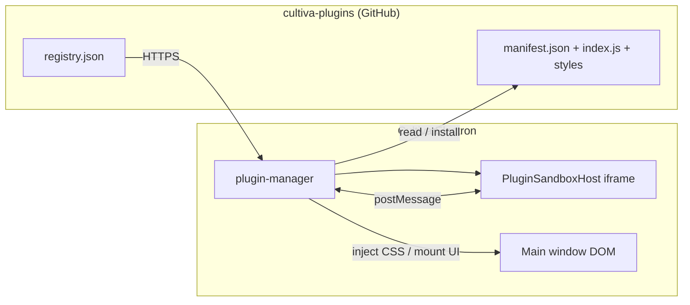

# Cultiva Plugin Author Guide

> **Audience:** developers publishing plugins in **[cultiva-plugins](https://github.com/krwg/cultiva-plugins)** and anyone extending the **desktop (Electron)** app.  
> **Requires:** Cultiva **≥ 1.7.0 · Linden** for registry 3.x plugins (sha256, `data.read`, manifest settings UI). **Appearance contributions** and the expanded **`context.app` / `context.ui` surface** below require **≥ 2.0.0 · Rowan**.  
> **Runtime model:** the Cultiva client **downloads** manifests and files over HTTPS and installs them under the user profile (`userData/cultiva-plugins`). Plugin source in **cultiva-plugins** is for **development & publishing only** — the running app does **not** read your local repo path at runtime.

---

## Table of contents

1. [Architecture at a glance](#1-architecture-at-a-glance)  
2. [Store repository layout](#2-store-repository-layout)  
3. [`manifest.json` reference](#3-manifestjson-reference)  
4. [Entry script & sandbox lifecycle](#4-entry-script--sandbox-lifecycle)  
5. [`context` API](#5-context-api)  
6. [Main-window UI bridge (Cultiva ≥ 0.4.0)](#6-main-window-ui-bridge-cultiva--040)  
7. [`hooks` API](#7-hooks-api)  
8. [Security & constraints](#8-security--constraints)  
9. [Versioning & publishing](#9-versioning--publishing)  
10. [Checklist & troubleshooting](#10-checklist--troubleshooting)  

---

## 1. Architecture at a glance



| Component | Role |
|-----------|------|
| **Registry** | JSON list of plugin ids, versions, `baseUrl` (raw GitHub URL to the plugin folder). |
| **Manifest** | Declares id, entry file, optional `styles`, `minAppVersion`, marketing fields. |
| **Sandbox iframe** | Opaque-origin iframe; plugin code is executed as the body of `new Function('context','hooks', source)`. |
| **`plugin-manager` (renderer)** | Loads sandbox, wires RPC (`storage`, `ui.showNotification`), **main-window sheet/header/garden** bridge, injects CSS from `manifest.styles`. |

---

## 2. Store repository layout

Each plugin is a **top-level folder** in the cultiva-plugins repo:

```
your-plugin-id/
  manifest.json      # required
  index.js           # required (or path in manifest.entry)
  styles.css         # optional; list in manifest.styles
```

The app fetches **`registry.json`**, resolves **`baseUrl`**, then downloads **`manifest.json`**, the **entry** script, and every file listed in **`manifest.styles`**.

---

## 3. `manifest.json` reference

| Field | Required | Description |
|-------|----------|-------------|
| `id` | **yes** | Lowercase plugin folder name; letters, digits, `_`, `-` only. |
| `name` | **yes** | Human-readable name (Settings → Plugins). |
| `version` | **yes** | SemVer string; must match the version you advertise in `registry.json`. |
| `description` | **yes** | Short summary for the store UI. |
| `icon` | **yes** | Short string for legacy UI (use `""` — catalog shows letter placeholders). |
| `entry` | **yes** | Entry script filename (default `index.js` if omitted in older docs). |
| `styles` | no | Array of CSS paths **relative to the plugin folder**; injected into the **main** window `<head>`. |
| `permissions` | recommended | `network`, `storage`, `ui`, `habits.read`, `settings.read` — see [Permissions](#permissions). |
| `data` | no | Array of bundled static files (for example JSON dictionaries) accessible via `context.data.read(path)`. |
| `settings` | no | Manifest-driven settings fields rendered by Cultiva (no per-plugin UI code in the app). |
| `i18n` | no | Optional catalog strings in `registry.json` / manifest: `{ "ru": { "name", "description" } }`. Settings fields support their own `field.i18n`. |
| `minAppVersion` | **strongly recommended** | Lowest Cultiva version you tested. Examples: header-only widgets **`1.1.0`**, garden/hooks plugins **`1.7.0`**, habit write / analytics **`2.0.0`**. |
| `storeFlow` | no | Registry-only: `direct` (one-tap Install) or `get` (App Store style Get → Install). New Cultiva 2.0 plugins default to `get`. |
| `contributes` | no | Declarative themes, backgrounds, ambient sounds, and extra Settings sidebar sections — see [Contributions](#contributions-manifest--runtime). |

**Minimal example**

```json
{
  "id": "example",
  "name": "Example",
  "version": "1.0.0",
  "description": "Demonstrates header + sheet.",
  "icon": "",
  "entry": "index.js",
  "styles": ["styles.css"],
  "permissions": ["storage", "ui"],
  "data": ["cities-ru.json"],
  "minAppVersion": "1.7.0"
}
```

---

## 4. Entry script & sandbox lifecycle

The host wraps your file like this:

```js
(function (context, hooks) {
  /* YOUR PLUGIN SOURCE */
})(context, hooks);
```

You **must** end the file by **returning an instance** (typically `return new MyPlugin(context, hooks);`).

### Lifecycle methods

| Method | When |
|--------|------|
| **`async onEnable()`** | After the instance is constructed; use for `registerHeaderItem`, loading settings, timers. |
| **`onDisable()`** | Plugin unload / disable; clear intervals, release audio handles, etc. |

### Instance methods & the host proxy

The renderer builds an **`instanceProxy`** that forwards `INVOKE_INSTANCE` into the sandbox. Method names are collected from the **prototype chain** of your instance, so **ES `class` plugins** behave the same as plain objects.

The header chip calls the sandbox **`onClick`** handler from `registerHeaderItem` via `HEADER_ONCLICK`.

Garden widgets can expose click targets with **`data-plugin-act="methodName"`** on buttons/links inside injected HTML. The host forwards the call to your instance method in the sandbox (legacy `data-quote-act` is still accepted for one release).

---

## Permissions

| Permission | RPC / capability |
|------------|------------------|
| `storage` | `context.storage.get/set/remove/listKeys` |
| `ui` | `showNotification`, `confirm`, `alert`, header/garden/sheet UI, theme read APIs (`getThemeColor`, `getThemeTokens`, …), `previewTheme`, `setHeaderBadge`, `focusHabit` |
| `network` | `fetch()` inside the sandbox; `ui.openExternal(url)` |
| `habits.read` | `app.getHabits`, `getHabit`, `getHabitsCompletedToday`, `getWeeklySummary` |
| `habits.write` | `app.completeHabit`, `app.logQuantity` |
| `settings.read` | `app.getSettings()` — public app settings subset (lang, theme, flags) |
| `settings.write` | `setTheme`, `setBackground`, `applyAppearancePreset`, `setLang`, `setFocusMode`, `setAccentColor`, `setAmbientSound`, `setHolidayRegion`, `setShowTrophies` |

Cultiva **never** hardcodes plugin ids. Names, descriptions, and settings labels come from **`registry.json` / `manifest.json`** (`i18n` blocks).

---

## 5. `context` API

### `context.manifest`

Parsed `manifest.json` object.

### `context.storage`

| Call | Permission | Semantics |
|------|------------|-----------|
| `await context.storage.get(key)` | `storage` | Per-plugin key/value (async). Keys are namespaced by the host (`plugin_<id>_`). |
| `await context.storage.set(key, value)` | `storage` | Persist a JSON-serializable value. |
| `await context.storage.remove(key)` | `storage` | Clear a namespaced key. |
| `await context.storage.listKeys()` | `storage` | List keys for this plugin (without the `plugin_<id>_` prefix). |

### `context.data`

| Call | Semantics |
|------|-----------|
| `await context.data.read(path)` | Reads a file listed in `manifest.data`. JSON files are parsed by the host before returning. |

### `context.app`

| Call | Permission | Returns |
|------|------------|---------|
| `await context.app.getLocale()` | `ui` | `'en'` \| `'ru'` |
| `await context.app.getThemeColor('--text-primary')` | `ui` | Resolved CSS color from the active theme |
| `await context.app.getThemeTokens()` | `ui` | Map of active theme CSS variables (`--bg-primary`, …) |
| `await context.app.getThemeTokenKeys()` | `ui` | List of supported theme token names |
| `await context.app.getBuiltinThemes()` | `ui` | Built-in theme ids usable with `extends` (`birch`, `rowan`, `light`, `dark`, …) |
| `await context.app.getPluginThemes()` | `ui` | Installed plugin themes (id, label, group) |
| `await context.app.getPluginBackgrounds()` | `ui` | Installed plugin backgrounds |
| `await context.app.getPluginSounds()` | `ui` | Installed plugin ambient sounds |
| `await context.app.getVersion()` | `ui` | Cultiva semver string |
| `await context.app.getCodename()` | `ui` | Release codename (e.g. `Rowan`) |
| `await context.app.getPlatform()` | `ui` | `'win32'` \| `'darwin'` \| `'linux'` \| `'web'` |
| `await context.app.isDesktop()` | `ui` | `true` in Electron |
| `await context.app.getPluginId()` | `ui` | Current plugin id |
| `await context.app.getManifestSummary()` | `ui` | Sanitized manifest (`id`, `name`, `version`, `minAppVersion`, `permissions`) |
| `await context.app.compareVersions(a, b)` | `ui` | `-1` \| `0` \| `1` semver compare |
| `await context.app.getToday()` | `ui` | `YYYY-MM-DD` in the user's Cultiva timezone |
| `await context.app.getTimezone()` | `ui` | IANA zone or `'auto'` |
| `await context.app.getSettings()` | `settings.read` | `{ lang, theme, holidayRegion, pluginsEnabled, focusMode, showTrophies, streakGraceEnabled }` |
| `await context.app.getAccentColor()` | `ui` | User accent hex or `''` |
| `await context.app.setAccentColor(hex)` | `settings.write` | Set accent color |
| `await context.app.getBackgroundId()` | `ui` | Active background id |
| `await context.app.setAmbientSound(id)` | `settings.write` | Switch ambient sound (`none` or plugin/built-in id) |
| `await context.app.setLang('en' \| 'ru')` | `settings.write` | Switch UI language |
| `await context.app.getFocusMode()` | `ui` | Focus mode on/off |
| `await context.app.setFocusMode(on)` | `settings.write` | Toggle focus mode |
| `await context.app.getLowPowerMode()` | `ui` | Low-power preset on/off |
| `await context.app.getShowTrophies()` | `ui` | Trophy display on/off |
| `await context.app.setShowTrophies(on)` | `settings.write` | Toggle trophy display |
| `await context.app.getHolidayRegion()` | `ui` | Holiday region code |
| `await context.app.setHolidayRegion(region)` | `settings.write` | Set holiday region |
| `await context.app.openSettings(section?)` | `ui` | Open Settings modal (`appearance`, `plugins`, …) |
| `await context.app.openCalendar()` | `ui` | Open calendar window/page |
| `await context.app.reloadGarden()` | `ui` | Re-render habit garden |
| `await context.app.syncTray()` | `ui` | Refresh system tray habit list (desktop) |
| `await context.app.getBuiltinBackgrounds()` | `ui` | Built-in background ids |
| `await context.app.getAppearancePresets()` | `ui` | Registered appearance presets |
| `await context.app.setTheme(themeId)` | `settings.write` | Switch theme (built-in or `plugin-…` id); persists settings |
| `await context.app.setBackground(bgId)` | `settings.write` | Switch background (`none`, built-in, or `plugin-…`) |
| `await context.app.previewTheme(themeId)` | `ui` | Temporarily apply a theme without saving |
| `await context.app.clearThemePreview()` | `ui` | Revert the last `previewTheme` call |
| `await context.app.applyAppearancePreset(presetId)` | `settings.write` | Apply a bundled preset (theme + background + sound) |
| `await context.app.getHabits()` | `habits.read` | Read-only array of habit snapshots |
| `await context.app.getHabit(id)` | `habits.read` | Single habit snapshot or `null` |
| `await context.app.getHabitsCompletedToday()` | `habits.read` | Habits completed today |
| `await context.app.getWeeklySummary()` | `habits.read` | Weekly completion analytics |
| `await context.app.completeHabit(id)` | `habits.write` | Mark habit done for today |
| `await context.app.logQuantity(id, value)` | `habits.write` | Log quantity progress |

### `context.ui` — requires `ui` permission for notifications; registration is always available in sandbox

| Method | Description |
|--------|-------------|
| **`registerHeaderItem({ label, icon, onClick? })`** | Registers a chip in the **main** window header. `onClick` runs **inside the sandbox** when the user activates the chip. |
| **`registerGardenWidget({ position?, render, onTapMethod? })`** | Registers a garden widget. Inside **`render(relay)`**, set **`relay.innerHTML = '...'`** **or** call **`relay.appendChild(node)`**. Use **`data-plugin-act`** on interactive elements, or **`onTapMethod`** for whole-widget taps. |
| **`updateGardenHtml(html)`** | After registration, pushes new inner HTML for the same garden wrapper. |
| **`openMainSheet(html)`** / **`closeMainSheet()`** | Main-window sheet overlay. |
| **`updateMainHeader({ label?, icon?, labelColor? })`** | Live header chip updates. |
| **`showNotification(icon, text)`** | Toast in the main app. |
| **`confirm(message, options?)`** | Native-styled confirm dialog; returns `boolean`. |
| **`alert(message, options?)`** | Native-styled alert dialog. |
| **`openExternal(url)`** | Open `https://…` in the system browser (`network` permission). |
| **`setHeaderBadge(text)`** | Small badge on your header chip (e.g. `3` or `!`). |
| **`focusHabit(habitId)`** | Scroll to and focus a habit card in the garden. |

### Settings UI & i18n

Declare `settings` in `manifest.json`. Cultiva renders the form — **no plugin id checks in app code**.

```json
{
  "key": "city",
  "label": "City",
  "type": "text",
  "i18n": {
    "ru": { "label": "Город" }
  }
}
```

For `type: "favorites"` lists, add `emptyMessage` under `i18n.<locale>`.

---

## 6. Main-window UI bridge (Cultiva ≥ 0.4.0)

Plugin JavaScript **cannot** call `document.querySelector` on the Cultiva window — it only sees the **sandbox document**. Anything that must appear **on top of the real app** (modals, sheets, live header text) goes through the bridge below.

### Sheet API

| Method | Purpose |
|--------|---------|
| **`context.ui.openMainSheet(html)`** | Mounts a modal **sheet** in the main window (`position: fixed`, full-screen dim + your markup). |
| **`context.ui.closeMainSheet()`** | Removes the sheet for your plugin. |

**Markup contract:** use **`data-*`** attributes so the host can delegate events without executing arbitrary `<script>` tags from your HTML (inline scripts in injected HTML are not a supported pattern).

### Header updates

| Method | Purpose |
|--------|---------|
| **`context.ui.updateMainHeader({ label?, icon?, labelColor? })`** | Updates the header chip. Pass **`icon: ''`** for a text-only chip. Optional **`labelColor`** (CSS color) for dynamic styling (e.g. rainbow clock). |

### Delegated actions (main window → sandbox)

The host forwards user interaction as **`MODAL_ACTION`** with `(action, payload)` to **`onModalAction`** on your plugin instance if you implement it.

**Clicks** — target element or ancestor with **`data-cultiva-act`**:

| Attribute | Behaviour |
|-----------|-----------|
| `data-cultiva-act="close"` | Closes the sheet (also Escape on the sheet root). |
| `data-cultiva-act="yourAction"` | Forwards **`yourAction`** with a merged **payload**: JSON from **`data-cultiva-payload`**, geographic fields **`data-lat` / `data-lon` / `data-city`**, **`data-tz`**, **`data-station`**, **`data-minutes`**, and optionally **`data-cultiva-collect="1"`** on a control (collects named fields inside the nearest **`.cultiva-sheet-card`**). |

**`change` events** — element with **`data-cultiva-change-act="name"`** → `action === "name"`, payload includes **`value`** and relevant `dataset` fields.

**`input` events** — element with **`data-cultiva-input-act="search"`** → `action === "input:search"`, payload `{ value }`.

Implement:

```javascript
async onModalAction(action, payload) {
  if (action === 'close') { /* host already closed; optional cleanup */ return; }
  if (action === 'save' && payload) { /* apply payload */ }
}
```

### Styling sheets

Ship rules in **`manifest.styles`** for classes such as **`.cultiva-sheet-card`**, **`.cultiva-sheet-overlay`**, **`.cultiva-pill`**, etc., so your sheet matches Cultiva tokens (`var(--bg-primary)`, `var(--text-primary)`, …).

---

## Contributions (manifest & runtime)

Cultiva **2.0+** lets plugins extend appearance and Settings navigation without forking the app. Declare items in **`manifest.contributes`** or register at runtime via **`context.ui`** (requires **`ui`** permission). Core Settings sections cannot be removed — plugins may only add/reorder their own sidebar items.

### Manifest `contributes`

```json
{
  "contributes": {
    "themes": [{
      "id": "snow-ink",
      "label": "Snow Ink",
      "group": "light",
      "extends": "birch",
      "monochrome": true,
      "variables": { "--bg-secondary": "#ffffff" },
      "i18n": { "ru": { "label": "Снежные чернила" } }
    }],
    "backgrounds": [{ "id": "stars", "label": "Starry Night", "css": "bg-stars.css", "html": "<div class='star-layer'></div>" }],
    "sounds": [{ "id": "rain", "label": "Rain", "src": "rain.mp3", "loop": true }],
    "fonts": [{ "id": "display", "family": "Plugin Display", "src": "display.woff2" }],
    "appearancePresets": [{ "id": "bw-calm", "label": "B&W Calm", "theme": "plugin-your-id-snow-ink", "background": "none", "accentColor": null }],
    "settingsNav": [{ "id": "guide", "label": "Plugin guide", "position": "after:plugins", "html": "<p>Hello</p>" }]
  }
}
```

| Kind | Appears in | Notes |
|------|------------|-------|
| `themes` | Settings → Appearance → Theme | IDs are namespaced (`plugin-your-id-midnight`). Use `css` file, inline `cssText`, or **`extends` + `variables`** to inherit a built-in palette (recommended). Set `monochrome: true` for auto B&W button overrides. |
| `backgrounds` | Settings → Appearance → Background | CSS layers; optional `html` markup is mounted into a dedicated `#bg-plugin-…` layer. |
| `sounds` | Settings → Appearance → Ambient sound | Local audio from plugin folder; off by default. |
| `fonts` | (global) | Injects `@font-face` from plugin folder via `getPluginResourcePath`. |
| `appearancePresets` | (runtime) | Bundled theme/background/sound combos; apply with `context.app.applyAppearancePreset(id)`. |
| `settingsNav` | Settings sidebar | `position`: `before:about` or `after:appearance` (anchor must be a core section). |

### Runtime registration

```js
// Extend built-in Birch (White Rowan) — appears in theme dropdown
context.ui.registerTheme({
  id: 'snow-ink',
  label: 'Snow Ink',
  group: 'light',
  extends: 'birch',
  monochrome: true,
  variables: { '--bg-tertiary': '#fafafa' },
  i18n: { ru: { label: 'Снежные чернила' } }
});

context.ui.registerBackground({ id: 'mist', label: 'Mist', css: 'bg-mist.css', html: '<div class="mist"></div>' });
context.ui.registerSound({ id: 'wind', label: 'Wind', src: 'wind.mp3', loop: true, volume: 0.5 });
context.ui.registerFont({ id: 'display', family: 'Plugin Display', src: 'display.woff2' });
context.ui.registerAppearancePreset({
  id: 'bw-calm',
  label: 'B&W Calm',
  theme: 'plugin-your-plugin-id-snow-ink',
  background: 'none',
  accentColor: null
});
context.ui.registerSettingsNav({ id: 'tips', label: 'Tips', position: 'before:about', html: '<p>…</p>' });

context.ui.unregisterTheme('snow-ink');
context.ui.unregisterBackground('mist');
context.ui.unregisterSound('wind');
context.ui.removeSettingsNav('your-plugin-id:tips'); // only your own items
```

### Theme hooks

```js
hooks.on('onThemeApplied', ({ theme, resolved }) => {
  // theme = settings value; resolved = body class id after auto/light/dark resolve
});

hooks.on('onBackgroundApplied', (backgroundId) => { /* … */ });
hooks.on('onLanguageChange', (lang) => { /* 'en' | 'ru' */ });
hooks.on('onFocusModeChange', (enabled) => { /* boolean */ });
```

Contributions are cleared automatically when a plugin is disabled or uninstalled.

### Store catalog (registry)

| Field | Purpose |
|-------|---------|
| `minAppVersion` | Shown as a badge in the in-app store (e.g. `1.1.0`, `1.7.0`, `2.0.0`). |
| `storeFlow` | Deprecated in registry — Cultiva uses local **ever-installed** history: first time → **Get**, previously installed on device → **Install**. |
| `i18n.en` / `i18n.ru` | Product descriptions in the catalog — write 1–2 full sentences; they are not truncated in Cultiva 2.0. |

---

## 7. `hooks` API

Subscribe with **`hooks.on(hookName, callback)`**. Available hook names are defined by the host; common examples include:

- `onAppStart`
- `onHabitComplete`
- `onSettingsChange`
- `onThemeApplied` — `{ theme, resolved }` after theme CSS is loaded
- `onBackgroundApplied` — background id after user or plugin change
- `onLanguageChange` — `'en'` \| `'ru'`
- `onFocusModeChange` — boolean

The sandbox registers interest via postMessage; the host invokes **`INVOKE_HOOK`** when events fire.

---

## 8. Security & constraints

| Rule | Reason |
|------|--------|
| **No `window.electron`** in sandbox | Prevents privileged renderer access. |
| **No main-window DOM from sandbox** | Prevents XSS / confused-deputy issues; use the bridge APIs. |
| **No `fetch` to `file:`** | Blocked by sandbox policy. |
| **CSS only via `manifest.styles`** | Keeps styling auditable and scoped to trusted file list. |
| **Escape user-controlled strings** in HTML you inject | Treat sheet HTML like any templated UI — encode or sanitize text. |

The host maintains a **CSP** and RPC **allowlist** (see `src/core/plugin-rpc.js`). Do not rely on undocumented RPC channels.

---

## 9. Versioning & publishing

1. Bump **`version`** in `manifest.json`.  
2. Bump the same version for that plugin in **`registry.json`**.  
3. Recompute file checksums in `registry.json.sha256` (e.g. `node scripts/compute-registry-sha256.mjs`).  
4. Push to **`main`** on `krwg/cultiva-plugins`.  

Users install or update from **Settings → Plugins**; the client re-downloads files from `baseUrl`.

---

## 10. Checklist & troubleshooting

### Pre-flight checklist

- [ ] Valid JSON in `manifest.json`; `entry` file exists and is UTF-8 (no BOM issues).  
- [ ] Final line: `return new YourPlugin(context, hooks);`  
- [ ] No `window.electron` or direct main-DOM access — use **`openMainSheet`**, **`updateMainHeader`**, garden relay.  
- [ ] Styles listed in `manifest.styles` if you ship CSS.  
- [ ] **`minAppVersion`** reflects the lowest Cultiva build you tested (`1.1.0` header-only, `1.7.0` garden/hooks, `2.0.0` habit write).  
- [ ] `registry.json` **`baseUrl`** points at **raw** GitHub paths for your folder.  

### Common issues

| Symptom | Likely cause |
|---------|----------------|
| Header chip never updates | Use **`updateMainHeader`** instead of querying DOM from sandbox. |
| Modal “does nothing” / invisible | You appended to **sandbox** `document.body` — use **`openMainSheet`**. |
| Garden empty | Use **`relay.innerHTML`** or **`appendChild`** on the relay; ensure **`registerGardenWidget`** ran. |
| `openWeatherModal` not called from garden | Pass **`onTapMethod: 'openWeatherModal'`** (or your method name) in **`registerGardenWidget`**. |
| Portable / Windows icon errors (app repo) | Ensure `prebuild` runs **`sync-build-icon.mjs`** so **`build/icon.ico`** includes **256×256**. |
| Install fails on Cultiva 1.7 with a 2.0 plugin | User sees a short message: *«Плагину нужна Cultiva 2.0.0+. Обновите приложение.»* — set **`minAppVersion`** honestly in manifest + registry. |
| Theme not in dropdown after install | Use **`extends` + `variables`** on a built-in theme (`birch`, `rowan`, …); ensure theme CSS is in **`manifest.styles`** or `contributes.themes[].css`. |

---

### Links

| Resource | URL |
|----------|-----|
| Cultiva (desktop) | https://github.com/krwg/cultiva |
| cultiva-plugins (registry) | https://github.com/krwg/cultiva-plugins |
| Plugin catalog (Pages) | https://krwg.github.io/cultiva-plugins/ |
| Latest Cultiva release | https://github.com/krwg/cultiva/releases/latest |
| Author typings | `docs/cultiva-plugin.d.ts` in this repo |

---

*This guide tracks the **2.0.0 · Rowan** plugin surface. When in doubt, inspect `src/core/plugin-sandbox-host.js`, `src/core/plugin-manager.js`, and `src/core/plugin-rpc.js` in the Cultiva repo for the authoritative protocol.*
